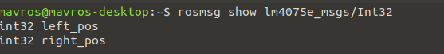
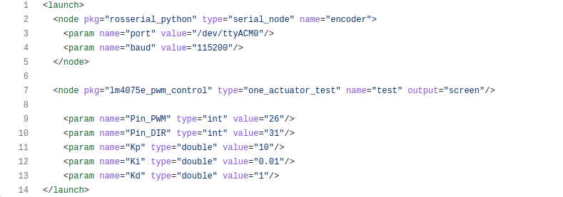

# LM4075E_PWM_CONTROL

Both actuator

Topic to subscribe to:

/encoder_data, /des_pos

The two topic shares the same message(lm4075e_msgs/Int32).

Message Field



When you just want to execute one actuator...

Encoder launch
```
rosrun rosserial_python serial_node.py /dev/ttyACM0 _baud:=115200
```

Controller launch
```
roslaunch lm4075e_pwm_control one_lm4075e_pwm_control.launch
```

Launch File Info


